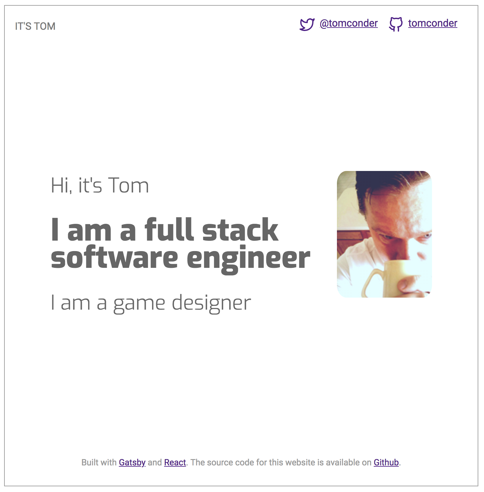

# itstom-co
This is the code to my website, [https://itstom.co](itstom.co). This is a personal project I used to build my web 
development skills.

## Screenshots

### Built with

* [Gatsby](https://github.com/gatsbyjs/gatsby)
* [React](https://github.com/facebook/react)

### Starting point

* [gatsby-starter-hello-world](https://github.com/gatsbyjs/gatsby-starter-hello-world)

### Additional plugins and packages

* [gatsby-plugin-react-helmet](https://github.com/gatsbyjs/gatsby/tree/master/packages/gatsby-plugin-react-helmet)
* [gatsby-plugin-manifest](https://github.com/gatsbyjs/gatsby/tree/master/packages/gatsby-plugin-manifest)
* [gatsby-plugin-offline](https://github.com/gatsbyjs/gatsby/tree/master/packages/gatsby-plugin-offline)

## Setup

1. Install gatsby-cli ([docs](https://www.gatsbyjs.org/tutorial/part-one/#install-the-hello-world-starter))
2. Clone the repository to your localhost
3. Install dependencies (yarn install)
4. Use gatsby-cli to start in development mode ([docs](https://www.gatsbyjs.org/docs/))
5. Have fun.