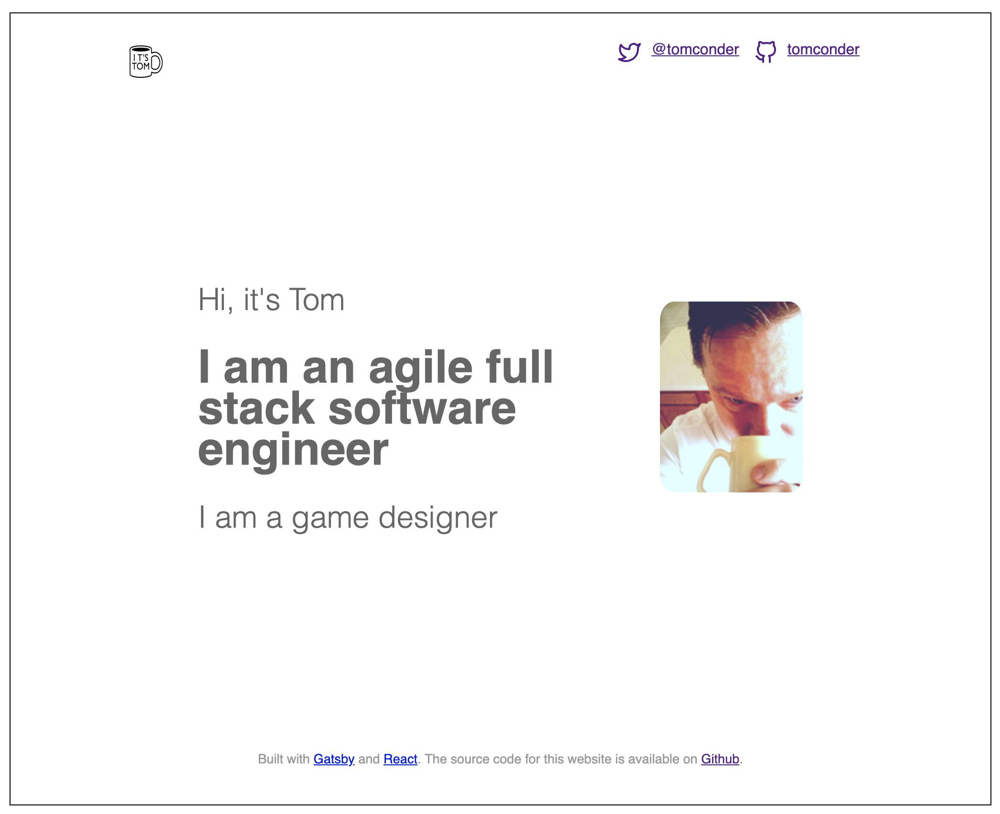

# itstom-co

[](https://github.com/tomconder/itstom-co/tags) [](https://github.com/tomconder/itstom-co/blob/develop/LICENSE) [](https://travis-ci.com/tomconder/itstom-co)

This is the code to my website, [itstom.co](https://itstom.co). It is a personal project to showcase my web development skills.

## Screenshot



### Built with

- [Gatsby](https://github.com/gatsbyjs/gatsby)
- [React](https://github.com/facebook/react)

## Setup

```bash
# install gatsby's command line tool
$ npm install --global gatsby-cli

# install dependencies
$ yarn install

# serve with hot reload at localhost:8000
$ gatsby develop

# build for production at localhost:9000
$ gatsby build
$ gatsby server
```

For detailed explanation on the gatsby cli, check out the [Gatsby docs](https://www.gatsbyjs.org/docs/).

## Lint Checks

Run lint checks with yarn

```bash
# run lint checks
$ yarn lint

# automatically fix fixable lint issues
$ yarn lint:fix

# run sass lint checks
$ yarn lint:sass
```

## Tests

Run tests with yarn.

```bash
# run test
$ yarn test

# run test coverage
$ yarn test:coverage
```

## Deploy

Deploy using the deploy script.

```bash
# deploy
$ yarn deploy
```
